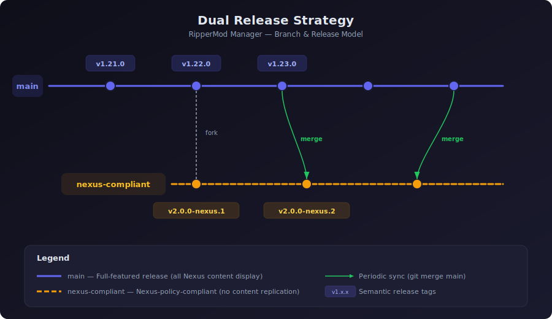
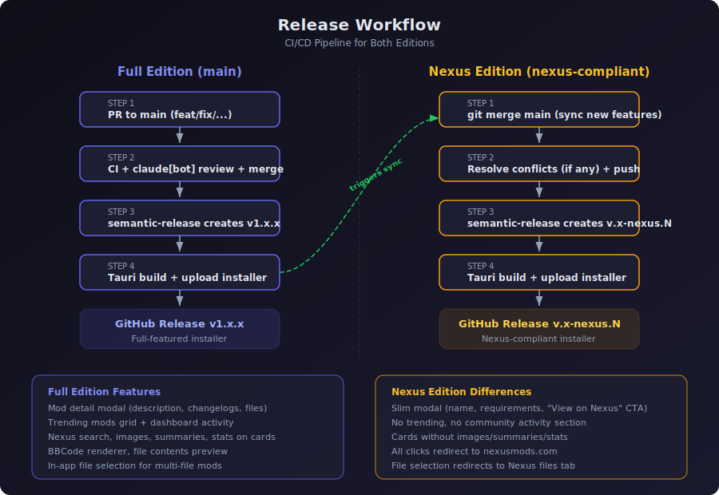

# Dual Release Strategy

RipperMod Manager ships two editions from a single repository to comply with Nexus Mods API policies while preserving full functionality for community builds.



## Editions

| Edition | Branch | Tags | Distribution |
|---------|--------|------|-------------|
| **Full** | `main` | `v1.x.x` | GitHub Releases, community |
| **Nexus** | `nexus-compliant` | `vX.x.x-nexus.N` | Nexus Mods page |

### Full Edition (`main`)

The complete application with all features enabled:

- Mod detail modal with description, changelogs, file list
- Trending mods grid and dashboard community activity
- Card images, summaries, endorsement/download counts
- In-app Nexus search, BBCode rendering, file contents preview
- Direct file selection for multi-file mods

### Nexus Edition (`nexus-compliant`)

A Nexus-policy-compliant build that redirects all discovery to nexusmods.com:

- Slim modal with name, version, requirements, and "View on Nexus Mods" CTA
- No trending, no community activity section
- Compact cards without images, summaries, or stats
- All card clicks and file selection redirect to nexusmods.com
- Core management features unchanged (install, conflicts, profiles, updates)

## Release Workflow



### Full Edition Release (automatic)

Releases are fully automated via semantic-release on every push to `main`:

1. Create a PR to `main` with a conventional commit title
2. CI runs (backend lint/test, frontend lint/build, Tauri build)
3. claude[bot] reviews the PR
4. Squash merge to `main`
5. semantic-release analyzes the commit, creates a `vX.Y.Z` tag + GitHub Release
6. The build job compiles the Tauri installer and uploads it to the release

### Nexus Edition Release (sync + automatic)

Releases trigger automatically when `nexus-compliant` receives new commits:

1. After a main release, sync the changes:
   ```bash
   git checkout nexus-compliant
   git fetch origin
   git merge origin/main
   ```
2. Resolve any conflicts (typically only in the ~16 divergent files)
3. Push to `nexus-compliant`
4. semantic-release creates a `vX.Y.Z-nexus.N` tag + GitHub Release
5. The build job compiles the Nexus-compliant installer

## Sync Procedure

### When to sync

Sync `nexus-compliant` after each meaningful release on `main` or batch of features. Not every commit needs immediate sync.

### How to sync

```bash
# Switch to the nexus-compliant branch
git checkout nexus-compliant

# Fetch latest from remote
git fetch origin

# Merge main into nexus-compliant
git merge origin/main

# If conflicts occur, resolve them:
#   - For deleted files (TrendingGrid, bbcode.ts, trending router/service):
#     keep them deleted (accept "ours")
#   - For modified files (ModDetailModal, NexusModCard, grids, schemas):
#     keep the nexus-compliant version (slim modal, no browsing props)
#   - For unrelated files (new features, bug fixes):
#     accept the incoming changes from main

# Push to trigger the nexus release
git push
```

### Conflict-prone files

These files diverge between branches and may conflict during sync:

| File | Divergence |
|------|-----------|
| `frontend/src/components/mods/ModDetailModal.tsx` | Full 3-tab modal vs slim actions panel |
| `frontend/src/components/mods/NexusModCard.tsx` | Image/summary/stats vs compact card |
| `frontend/src/components/mods/NexusAccountGrid.tsx` | Opens modal vs opens Nexus URL |
| `frontend/src/components/mods/NexusMatchedGrid.tsx` | Opens modal vs opens Nexus URL |
| `frontend/src/pages/GameDetailPage.tsx` | Has trending tab vs no trending tab |
| `frontend/src/pages/DashboardPage.tsx` | Has community activity vs removed |
| `frontend/src/hooks/queries.ts` | useModDetail/useTrendingMods vs useModSummary |
| `frontend/src/types/api.ts` | Full types vs slimmed types |
| `backend/src/rippermod_manager/routers/nexus.py` | Full endpoints vs summary-only |
| `backend/src/rippermod_manager/schemas/nexus.py` | Full schemas vs reduced schemas |

Files that will **never conflict** (most of the codebase):
- Scan/correlation pipeline, matching services
- Install/uninstall, FOMOD, archive management
- Conflict detection, load order, profiles
- Download management, SSO, NXM handler
- Vector store, chat agent
- All Tauri/Rust code

## Versioning

Both branches use [semantic-release](https://github.com/semantic-release/semantic-release) with conventional commits:

- `fix:` = PATCH, `feat:` = MINOR, `feat!:` / `fix!:` = MAJOR
- `main` produces stable versions: `v1.22.0`, `v1.23.0`, `v2.0.0`
- `nexus-compliant` produces prerelease versions: `v2.0.0-nexus.1`, `v2.0.0-nexus.2`

The `nexus` channel ensures versions never collide between branches.

## CI Configuration

### `.releaserc.json`

```json
{
  "branches": [
    "main",
    { "name": "nexus-compliant", "channel": "nexus", "prerelease": "nexus" }
  ]
}
```

### `.github/workflows/semantic-release.yml`

The workflow triggers on both branches with per-branch concurrency:

```yaml
on:
  push:
    branches: [main, nexus-compliant]

concurrency:
  group: release-${{ github.ref_name }}
  cancel-in-progress: false
```

This allows releases on both branches to run independently without blocking each other.

## Publishing to Nexus Mods

When submitting or updating the Nexus Mods page:

1. Build from the `nexus-compliant` branch (or use the `-nexus.N` GitHub Release)
2. The Nexus edition does **not** display:
   - Full mod descriptions, changelogs, or file lists
   - Trending mods or search results
   - Mod images, summaries, or statistics on cards
3. All discovery actions redirect users to nexusmods.com
4. Endorse/track mutations generate engagement for Nexus
5. Downloads for free users go through the NXM protocol (user visits Nexus to download)
