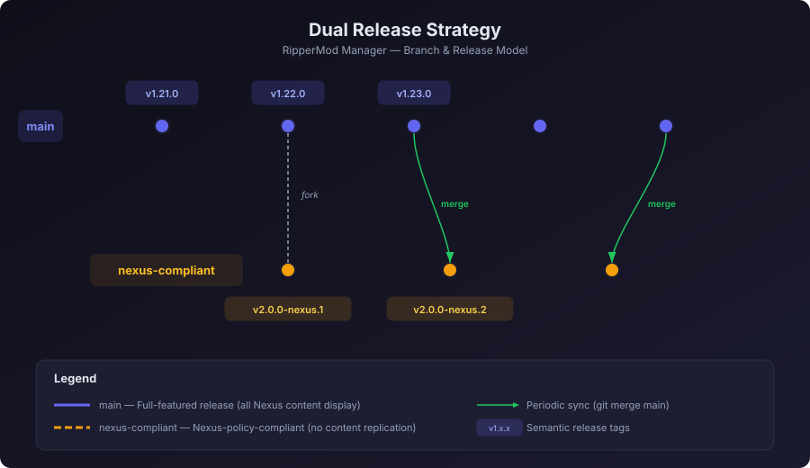

# Dual Release Strategy

RipperMod Manager ships two editions from a single repository: a Full edition for the community and a Nexus edition that satisfies the Nexus Mods file submission guidelines.



## Editions

| Edition | Branch | Tags | App Auto-Updater | Distribution |
|---------|--------|------|------------------|--------------|
| **Full** | `main` | `vX.Y.Z` | Yes (Tauri updater + Gist `stable.json`) | GitHub Releases, community |
| **Nexus** | `nexus-compliant` | `vX.Y.Z-nexus.N` | **No** | Nexus Mods page |

### Full Edition (`main`)

The complete application:

- Mod detail modal with description, changelogs, file list
- Trending mods grid and dashboard community activity
- Card images, summaries, endorsement/download counts
- In-app Nexus search, BBCode rendering, file contents preview
- Direct file selection for multi-file mods
- **In-app auto-updater** via Tauri updater plugin checking a Gist endpoint on startup

Neither edition ships LLM features anymore — the chat assistant, AI/web search matchers, and ChromaDB vector store were removed from both branches in May 2026 (see [v3.0.0-nexus.1] on `nexus-compliant` and the equivalent MAJOR bump on `main`).

### Nexus Edition (`nexus-compliant`)

A Nexus-policy-compliant build:

- Slim modal with thumbnail, name, requirements, and "View on Nexus Mods" CTA
- No trending page, no community activity section, no in-app Nexus search
- Cards retain thumbnails, summaries, and endorsement counts (standard mod manager metadata)
- All card clicks and file selection redirect to nexusmods.com
- Core management features unchanged (install, conflicts, profiles, mod updates checker)
- **No in-app auto-updater** — users download a new installer manually from the Nexus mod page

## NEVER merge between branches

`main` and `nexus-compliant` are **kept intentionally divergent**. The Nexus edition removes user-facing features that exist in the full edition (auto-updater, in-app Nexus content display, trending), so `git merge` would either reintroduce removed features (when merging `main → nexus-compliant`) or push compliance-required deletions onto the full edition (when merging `nexus-compliant → main`).

The admin bypass on the branch protection rules exists only for the `semantic-release` and `cla` workflows. It is not for human or agent use.

### How to propagate a fix between editions

Use `git cherry-pick` to bring an individual commit from one branch to the other. Skip cherry-picks that touch files that diverge between editions (see below); recreate those changes manually if needed.

```bash
# Find the commit on main you want in the Nexus edition
git log main --oneline

# Cherry-pick it onto nexus-compliant
git checkout nexus-compliant
git cherry-pick <sha>
# Resolve any conflicts conservatively — drop hunks that touch removed files
git push
```

### Files that diverge between branches

Touching any of these on `main` requires a manual mirror commit on `nexus-compliant` (not a cherry-pick):

| File / Area | Divergence |
|-------------|------------|
| `frontend/src/components/mods/ModDetailModal.tsx` | Full 3-tab modal vs slim actions panel |
| `frontend/src/components/mods/NexusModCard.tsx` | Image/summary/stats vs compact card |
| `frontend/src/components/mods/NexusAccountGrid.tsx` | Opens modal vs opens Nexus URL |
| `frontend/src/components/mods/NexusMatchedGrid.tsx` | Opens modal vs opens Nexus URL |
| `frontend/src/pages/GameDetailPage.tsx` | Has trending tab vs no trending tab |
| `frontend/src/pages/DashboardPage.tsx` | Has community activity vs removed |
| `frontend/src/hooks/queries.ts` | `useModDetail` + `useTrendingMods` vs summary-only |
| `frontend/src/types/api.ts` | Full types vs slimmed types |
| `frontend/src/layouts/RootLayout.tsx` | Renders `UpdateBanner` vs not |
| `frontend/src/components/layout/Sidebar.tsx` | Has update-available badge vs none |
| `frontend/src-tauri/Cargo.toml` | Has `tauri-plugin-updater` / `tauri-plugin-process` vs neither |
| `frontend/src-tauri/src/lib.rs` | Registers updater / process plugins vs neither |
| `frontend/src-tauri/tauri.conf.json` | Has `plugins.updater` + `createUpdaterArtifacts` vs neither |
| `frontend/src-tauri/capabilities/default.json` | Has `updater:default` + `process:allow-restart` vs neither |
| `backend/src/rippermod_manager/routers/nexus.py` | Full endpoints (search, mod detail) vs summary-only |
| `backend/src/rippermod_manager/schemas/nexus.py` | Full schemas vs reduced |
| `.github/workflows/semantic-release.yml` | Generates `latest.json`, updates Gist, signs artifacts vs none |
| `.github/workflows/ci.yml` | Has signing-key conditional vs single unconditional build |

### Files that exist only on `main`

These are present in the Full edition but were deleted in the Nexus edition and should not be reintroduced via cherry-pick:

- `backend/src/rippermod_manager/routers/trending.py`
- `backend/src/rippermod_manager/services/trending_service.py`
- `frontend/src/components/mods/TrendingGrid.tsx`
- `frontend/src/components/layout/UpdateBanner.tsx`
- `frontend/src/hooks/use-app-updater.ts`
- `frontend/src/stores/updater-store.ts`
- `frontend/src/lib/bbcode.ts`

## Release Workflow

### Full Edition Release (automatic)

Releases are fully automated via semantic-release on every push to `main`:

1. Open a PR to `main` with a conventional commit title
2. CI runs (backend lint/test, frontend lint/build, Tauri build)
3. claude[bot] reviews the PR
4. Squash merge to `main`
5. semantic-release analyzes the commit and creates a `vX.Y.Z` tag + GitHub Release
6. The build job compiles the Tauri installer, signs it for the updater, uploads `.exe`, `.sig`, `latest.json` to the release, and updates `stable.json` in the updater Gist

### Nexus Edition Release (automatic, no updater publish)

Releases trigger automatically when `nexus-compliant` receives new commits:

1. Cherry-pick commits onto `nexus-compliant` (or merge a PR opened against `nexus-compliant`)
2. semantic-release creates a `vX.Y.Z-nexus.N` tag + GitHub Release
3. The build job compiles the Nexus-compliant installer
4. The `upload-nexus` job downloads the `.exe`, wraps it in a `.zip` per Nexus help article 117 (bare `.exe` files are auto-quarantined), and uploads it to the Nexus mod page via the `Nexus-Mods/upload-action`
5. **No `latest.json` is generated, no Gist file is updated, no `.sig` is created.** The Tauri updater plugin is not bundled at all on this edition.

## Versioning

Both branches use [semantic-release](https://github.com/semantic-release/semantic-release) with the `conventionalcommits` preset and conventional commits:

- `fix:` = PATCH, `feat:` = MINOR, `feat!:` / `fix!:` = MAJOR, `chore:` / `docs:` / `refactor:` = no release
- `main` produces stable versions: `v1.22.0`, `v1.23.0`, `v2.0.0`
- `nexus-compliant` produces prerelease versions: `v2.0.0-nexus.1`, `v2.0.0-nexus.2`

The `nexus` channel ensures versions never collide between branches.

### `.releaserc.json`

```json
{
  "branches": [
    "main",
    { "name": "nexus-compliant", "channel": "nexus", "prerelease": "nexus" }
  ],
  "plugins": [
    ["@semantic-release/commit-analyzer", { "preset": "conventionalcommits" }],
    ["@semantic-release/release-notes-generator", { "preset": "conventionalcommits" }],
    ...
  ]
}
```

The `conventionalcommits` preset (not the default `angular` preset) is required for `feat!:` and `fix!:` to be parsed as breaking changes — the angular preset's header regex silently drops the `!` marker and treats the commit as a non-release.

### `.github/workflows/semantic-release.yml`

The workflow triggers on both branches with per-branch concurrency:

```yaml
on:
  push:
    branches: [main, nexus-compliant]

concurrency:
  group: release-${{ github.ref_name }}
  cancel-in-progress: false
```

This allows releases on both branches to run independently without blocking each other.

## Auto-Updater (Full edition only)

The Full edition checks a JSON endpoint for updates, hosted in a [GitHub Gist](https://gist.github.com/Y4rd13/94a555b2a282fca409c1eb0e0b828eb6):

| Edition | Gist File | Tauri Endpoint |
|---------|-----------|---------------|
| Full | `stable.json` | `https://gist.githubusercontent.com/Y4rd13/.../raw/stable.json` |
| Nexus | _(no updater bundled)_ | _(none)_ |

### How it works

1. The release workflow on `main` builds the Tauri installer and generates `latest.json`
2. After uploading release assets, a final step writes `stable.json` in the Gist
3. The Full-edition `tauri.conf.json` points to the `stable.json` URL
4. The Tauri updater plugin checks this endpoint on launch and prompts the user when a new version is available

### Why a Gist instead of `/releases/latest/`

GitHub's `/releases/latest/download/latest.json` always points to the **most recent release globally**, regardless of channel. The Gist provides stable, channel-specific URLs that the workflow updates independently.

### Authentication

The Gist update step uses a classic PAT (`GIST_TOKEN` repository secret) with `gist` scope. Fine-grained tokens have a [known bug](https://github.com/cli/cli/issues/7803) with Gist operations and should not be used.

## Publishing to Nexus Mods

When submitting or updating the Nexus Mods page:

1. Build from the `nexus-compliant` branch (or use the `-nexus.N` GitHub Release)
2. The Nexus edition does **not** replicate mod page content (descriptions, changelogs, file lists, trending, search), and does **not** auto-update
3. All discovery actions redirect users to nexusmods.com
4. Endorse/track mutations generate engagement for Nexus
5. Downloads for free users go through the NXM protocol (user visits Nexus to download)
6. The `upload-nexus` workflow job uploads each new `-nexus.N` installer (zip-wrapped per help article 117) to the Nexus file group automatically
